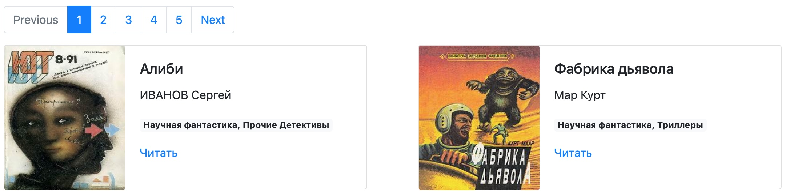

# Онлайн-библиотека

Сайт онлайн-библиотеки. 



## Как запустить

Книги взяты с сайта [tululu.org](https://tululu.org). 
- Для просмотра онлайн перейдите по [ссылке](https://krendelev.github.io/layout5_bibliosite/pages/index1.html).
- Для просмотра офлайн скачайте код и откройте в браузере файл `index1.html` из папки `pages`.
- Для модификации сайта скачайте код и установите зависимости. Скрипт `livereload` позволит отслеживать изменения в коде в реальном времени.
```sh
python3 on_reload.py
```

## Цели проекта

Код написан в учебных целях — это урок в курсе по Python и веб-разработке на сайте [Devman](https://dvmn.org).
